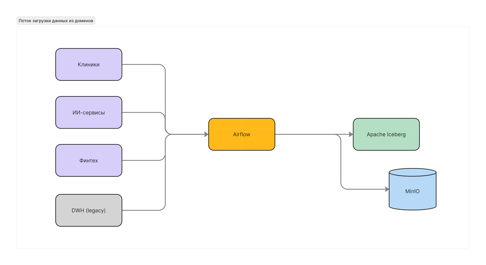
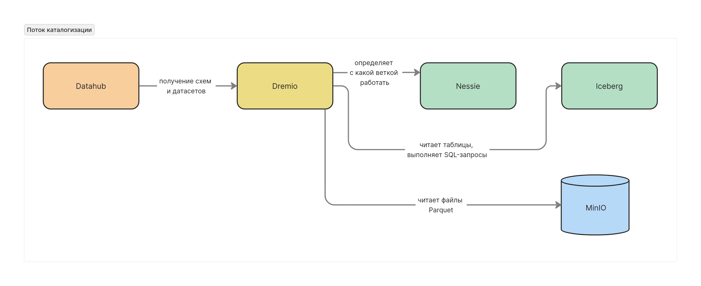

# Задание 2

## Домены

| Домен                  | Описание данных и функций                                               |
|-------------------------|-------------------------------------------------------------------------|
| **Медицина**    | Данные клиник, персонала, инвентаризация, управление оборудованием. |
| **Финансы**       | Банковские счета, транзакции, кредиты, платежи, финансовая отчетность.              |
| **ИИ-сервисы** | Результаты ML-моделей, предиктивная аналитика, рекомендации, обработка исследований. |
| **Общая платформа** | Техническая инфраструктура: MinIO, Iceberg, Nessie, Airflow, Dremio, DataHub.         |
| **Legacy**                | Исторические данные в DWH, отчеты в Power Builder, старые интеграции.                |

## Потоки данных между доменами

## Аргументация логики разделения на домены

Предлагаю разделить систему на домены: **Медицина**, **Финансы**, **ИИ-сервисы**, **Legacy**.

Разделение строится по принципам DDD (Domain-Driven Design) и Data Mesh, где каждая бизнес-область получает ответственность за свои данные.

1. **Отражение бизнес-структуры компании**  
   Каждый домен соответствует отдельной бизнес-области: клиники, финтех, ИИ, что делает архитектуру понятной для бизнеса.

2. **Разгрузка централизованной команды**  
   Вместо одной перегруженной команды DWH, каждая доменная команда отвечает за свои данные, повышая эффективность работы.

3. **Владение данными на уровне экспертов**  
   Доменная команда (например, медицины) лучше понимает свои данные и может быстрее внедрять изменения, улучшать качество и давать аналитику.

4. **Гибкость интеграции новых бизнесов**  
   Новые компании можно подключать как отдельные домены, без переделки всей архитектуры.

5. **Ускорение time-to-market**  
   Доменные команды могут работать параллельно, выкатывая свои витрины, отчёты и улучшения независимо друг от друга.

6. **Улучшение комплаенса и безопасности**  
   Разграничение данных по доменам позволяет точнее управлять доступом и выполнять требования регуляторов.

