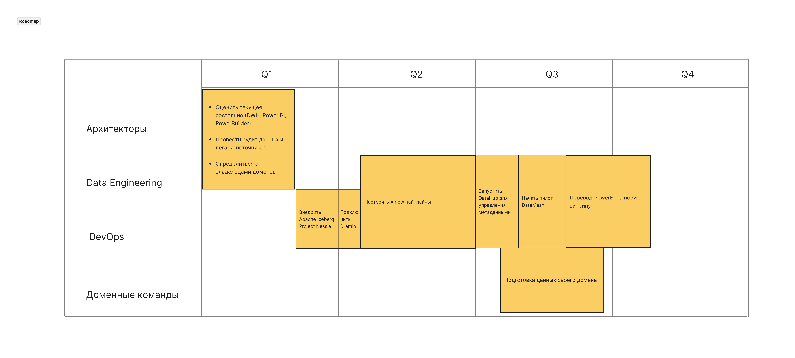

# Задание 3

## Техрадар

Техрадар можно посмотреть [тут](https://radar.thoughtworks.com/?documentId=https%3A%2F%2Fdocs.google.com%2Fspreadsheets%2Fd%2F1UJQODALP6ChZYhUtKcSc0LSP-kDJnZ4d4H8loEDStKM%2Fedit%3Fgid%3D0%23gid%3D0)

| Name              | Ring   | Quadrant  | Is New | Status     | Description                                                                                                                                               |
|-------------------|--------|-----------|--------|------------|----------------------------------------------------------------------------------------------------------------------------------------------------------|
| Apache Iceberg    | Adopt  | Platforms | FALSE  | moved in   | Apache Iceberg — это формат хранения таблиц для Data Lakehouse, который обеспечивает ACID-семантику, версионность и высокую производительность на больших данных. Он позволяет хранить данные в Parquet и управлять ими как полноценными таблицами. |
| Project Nessie    | Adopt  | Platforms | FALSE  | moved in   | Nessie — это слой управления версиями поверх Iceberg, который позволяет работать с данными как с git-репозиториями: создавать ветки, коммиты, снэпшоты и катить изменения. Это упрощает DevOps-подходы в данных. |
| Dremio           | Adopt  | Platforms | FALSE  | moved in   | Dremio — SQL-движок для аналитики на Data Lake, который обеспечивает быстрые запросы к Iceberg, Parquet и другим источникам, подключая BI-инструменты напрямую, без ETL. |
| Airflow          | Adopt  | Platforms | FALSE  | moved in   | Airflow — оркестратор задач, который управляет пайплайнами загрузки и трансформации данных, включая интеграцию с Spark/Trino для подготовки данных в Iceberg. |
| DataHub         | Adopt  | Platforms | FALSE  | moved in   | DataHub — каталог данных, который обеспечивает обнаружение, документацию и управление метаданными, включая связи с Dremio и Iceberg.                              |
| Data Mesh        | Trial  | Techniques| TRUE   | new        | Data Mesh — архитектурный подход, предполагающий разделение данных на домены и владение ими бизнес-командами, что повышает масштабируемость и ускоряет time-to-market. |
| Self-service BI | Trial  | Techniques| TRUE   | new        | Подход Self-service BI позволяет бизнесу самостоятельно строить отчеты и дашборды на Dremio/Iceberg, сокращая нагрузку на инженеров.                            |
| Apache Spark / Trino | Trial  | Platforms | TRUE   | new        | Spark и Trino используются как движки для подготовки данных в Iceberg, в частности из Airflow, обеспечивая высокую производительность на больших данных.       |
| SQL Server DWH  | Hold   | Platforms | FALSE  | no change  | Старый DWH на SQL Server 2008 — легаси-система, которую нужно постепенно выводить из эксплуатации.                                                           |
| Power Builder   | Hold   | Platforms | FALSE  | no change  | Power Builder — старый UI для отчетности, используемый на легаси-данных из DWH.                                                                              |
| Power BI        | Hold   | Platforms | FALSE  | no change  | Power BI на старой витрине DWH — часть легаси-стека, постепенно переводимая на Dremio/Iceberg.                                                              |

## Роадмап

## Обоснование этапов роадмапа

### Подготовка 

**Оценить текущее состояние (DWH, Power BI, PowerBuilder)**
→ нужно, чтобы понять объем легаси и приоритизировать миграцию.
Без инвентаризации можно потерять важные зависимости и сломать отчеты.

**Провести аудит данных и легаси-источников**
→ определяем качество данных, зоны риска, что помогает спланировать миграцию.

**Определиться с владельцами доменов**
→ основа Data Mesh — владение данными бизнесом. Без владельцев доменов невозможно запустить сетевую архитектуру.

### Основная миграция (Data Engineering, DevOps)

**Внедрить Apache Iceberg + Project Nessie**
→ Iceberg обеспечивает ACID, версионность, высокую производительность. Nessie позволяет управлять версиями, как git. Это фундамент Data Lakehouse.

**Подключить Dremio**
→ делает доступными данные Iceberg для аналитиков и BI-инструментов без ETL, что ускоряет вывод аналитики.

**Настроить Airflow пайплайны**
→ автоматизация ETL/ELT-процессов, ключ к стабильной работе данных.

**Запустить DataHub для управления метаданными**
→ каталог данных, помогает найти и понять, какие данные есть, кто владелец, как использовать.

**Начать пилот Data Mesh**
→ пилот позволяет протестировать архитектуру на одном-двух доменах, учесть ошибки перед масштабированием.

**Подготовка данных своего домена (Доменные команды)**
→ данные должны быть чистыми, описанными и готовы к подключению — ответственность бизнес-доменов.

### Уход от старой витрины

**Перевод Power BI на новую витрину**
→ последний шаг: BI на новом стеке. Это снижает нагрузку на старый DWH и завершает уход от легаси.